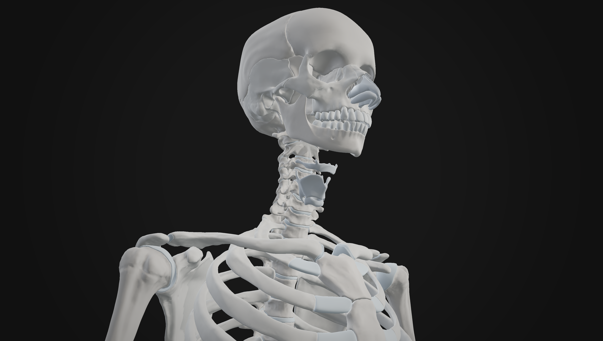
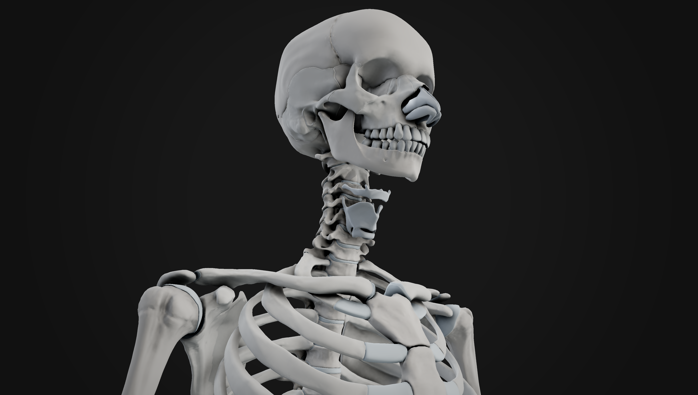

# N8AO-WebGPU

[](https://www.npmjs.com/package/n8ao-webgpu) [](https://x.com/N8Programs/status/2047049981123510344)

An efficient and visually pleasing implementation of Screen Space Ambient Occlusion for the **Three.js WebGPU/TSL** pipeline, adapted from [N8AO](https://github.com/N8python/n8ao) by N8python. **[Officially endorsed](https://x.com/N8Programs/status/2047049981123510344) by the original author.**

AO is critical for creating a sense of depth in any 3D scene — it darkens corners, crevices, and areas where geometry blocks light. If your scene looks "flat" or lacks depth cues, this package will help.

### Why N8AONode?

Three.js ships `GTAONode` and `SSGINode` as built-in WebGPU AO options, but both have practical drawbacks:

- **GTAO** — produces visible halo artifacts at depth discontinuities, especially at close zoom levels. Requires additional denoising that is not included out of the box, and the denoiser itself struggles at high zoom where sample density drops.
- **SSGI** — higher quality when static, but significantly more expensive. Temporal filtering helps at rest, yet any post-blur reintroduces halos. Performance degrades quickly on zoomed-in or large-scale scenes.

N8AO's approach — hemisphere sampling with built-in spatial + temporal denoising and depth-aware upsampling — stays clean at all zoom levels without external denoise passes, avoids halos, and maintains predictable performance via half-res mode and quality presets.

[](https://n8python.github.io/n8ao/example/)

|                                         Without AO                                          |                                              With AO                                              |
| :-----------------------------------------------------------------------------------------: | :-----------------------------------------------------------------------------------------------: |
|  |  |

<sub>Images from the original [N8AO](https://github.com/N8python/n8ao) by N8python</sub>

## Live Demo

See it in production on [OpenHuman Atlas](https://atlas.openhumanatlas.com), the project this package was originally developed for.

|                Without AO                 |                    With AO                    |
| :---------------------------------------: | :-------------------------------------------: |
|  |  |

- Live atlas: [atlas.openhumanatlas.com](https://atlas.openhumanatlas.com)
- Main site: [openhumanatlas.com](https://www.openhumanatlas.com)

## Installation

```bash
npm install n8ao-webgpu three
```

Peer dependency: `three@^0.182.0`

## Usage

`N8AONode` plugs directly into Three.js WebGPU `PostProcessing`:

```ts
import { PostProcessing } from "three/webgpu";
import { N8AONode, createN8AOScenePass } from "n8ao-webgpu";

const scenePass = createN8AOScenePass(scene, camera);

const n8ao = new N8AONode({
  beautyNode: scenePass.getTextureNode("output"),
  beautyTexture: scenePass.getTexture("output"),
  depthNode: scenePass.getTextureNode("depth"),
  depthTexture: scenePass.getTexture("depth"),
  normalNode: scenePass.getTextureNode("normal"),
  normalTexture: scenePass.getTexture("normal"),
  scenePassNode: scenePass,
  scene,
  camera,
});

const post = new PostProcessing(renderer);
post.outputNode = n8ao.getTextureNode();
```

That's it. The effect works out of the box with any Three.js WebGPU scene as long as the depth buffer is being written to.

## Configuration

The four principal parameters that control the look of the AO:

```ts
n8ao.configuration.aoRadius = 5.0;
n8ao.configuration.distanceFalloff = 1.0;
n8ao.configuration.intensity = 5.0;
n8ao.configuration.color = new THREE.Color(0, 0, 0);
```

**`aoRadius: number`** — Controls the radius/size of the ambient occlusion in world units. Set it too low and AO becomes an edge detector. Too high and it becomes overly soft. The radius should be one or two magnitudes less than scene scale: if your scene is 10 units across, try 0.1–1. If 100, try 1–10.

|                                             Radius 1                                              |                                             Radius 5                                              |                                             Radius 10                                              |
| :-----------------------------------------------------------------------------------------------: | :-----------------------------------------------------------------------------------------------: | :------------------------------------------------------------------------------------------------: |
|  |  |  |

**`distanceFalloff: number`** — Controls how fast the AO fades with distance relative to the radius. Defaults to 1. Decreasing it reduces haloing artifacts and improves accuracy; too small and the AO disappears entirely.

|                                             Distance Falloff 0.1                                              |                                             Distance Falloff 1                                              |                                             Distance Falloff 5                                              |
| :-----------------------------------------------------------------------------------------------------------: | :---------------------------------------------------------------------------------------------------------: | :---------------------------------------------------------------------------------------------------------: |
|  |  |  |

**`intensity: number`** — Artistic control — applies `pow(ao, intensity)` to darken occluded areas. An intensity of 2 is subtle; 5 is prominent.

**`color: THREE.Color`** — Color of the ambient occlusion. Default is black. Change it for a crude approximation of global illumination (e.g., a dark blue for sky-lit scenes). Expected in sRGB, automatically converted to linear.

|                                    Color Black (Normal AO)                                    |                                   Color Blue (Appropriate)                                   |                                   Color Red (Too Bright)                                    |
| :-------------------------------------------------------------------------------------------: | :------------------------------------------------------------------------------------------: | :-----------------------------------------------------------------------------------------: |
|  |  |  |

<sub>Configuration images from the original [N8AO](https://github.com/N8python/n8ao) by N8python</sub>

## Screen Space Radius

For scenes where the camera moves across different scales:

```ts
n8ao.configuration.screenSpaceRadius = true;
n8ao.configuration.aoRadius = 32; // pixels, recommended 16–64
n8ao.configuration.distanceFalloff = 0.2; // ratio, 0–1
```

When `screenSpaceRadius` is `true`, `aoRadius` is in pixels instead of world units and `distanceFalloff` becomes a screen-space ratio.

## Performance

Enable half-resolution mode for a 2×–4× performance boost:

```ts
n8ao.configuration.halfRes = true;
n8ao.configuration.depthAwareUpsampling = true; // on by default, highly recommended
```

### Quality Presets

Switch quality modes with `applyQualityMode`:

```ts
import { applyQualityMode } from "n8ao-webgpu";

applyQualityMode(n8ao.configuration, "Ultra");
```

| Quality Mode | AO Samples | Denoise Samples | Denoise Radius |            Best For             |
| :----------: | :--------: | :-------------: | :------------: | :-----------------------------: |
| Performance  |     8      |        4        |       12       |      Mobile, low-end iGPUs      |
|     Low      |     16     |        4        |       12       | High-end mobile, iGPUs, laptops |
|    Medium    |     16     |        8        |       12       |        Laptops, desktops        |
|     High     |     64     |        8        |       6        |    Desktops, dedicated GPUs     |
|    Ultra     |     64     |       16        |       6        |    Desktops, dedicated GPUs     |

Or set them manually:

```ts
n8ao.configuration.aoSamples = 16;
n8ao.configuration.denoiseSamples = 8;
n8ao.configuration.denoiseRadius = 12;
```

Changing quality is expensive (shader recompile). Do it once at startup.

## Display Modes

Useful for debugging and showcasing the AO effect:

```ts
import { resolveDisplayMode } from "n8ao-webgpu";

n8ao.configuration.displayMode = resolveDisplayMode("AO");
```

|   Mode   | Description                                      |                                              Preview                                               |
| :------: | :----------------------------------------------- | :------------------------------------------------------------------------------------------------: |
| Combined | Composites AO onto the scene — use in production |  |
|    AO    | Shows only the AO as black/white                 |              |
|  No AO   | Scene without AO                                 |         |
|  Split   | Side-by-side: scene with and without AO          |        |
| Split AO | Side-by-side: AO only and combined               |   |

<sub>Display mode images from the original [N8AO](https://github.com/N8python/n8ao) by N8python</sub>

## Transparency

Transparent objects with `depthWrite` disabled will not occlude anything and look correct. For transparent objects with `depthWrite` enabled, results are generally fine as long as alpha isn't too low.

```ts
// Force an object to be treated as opaque
mesh.userData.treatAsOpaque = true;

// Exclude an object from receiving AO
mesh.userData.cannotReceiveAO = true;
```

## API Reference

The package exports:

| Export                             | Description                                                  |
| :--------------------------------- | :----------------------------------------------------------- |
| `N8AONode`                         | Core AO compositor node for WebGPU PostProcessing            |
| `createN8AOScenePass()`            | Helper to create the required beauty/depth/normal scene pass |
| `createDefaultN8AOConfiguration()` | Returns a default configuration object                       |
| `applyQualityMode()`               | Apply a named quality preset to a configuration              |
| `resolveDisplayMode()`             | Convert a display mode name to its numeric value             |

## Limitations

Like all screen-space methods, geometry that is offscreen or occluded by another object will not contribute to occlusion. Haloing is minimal but can appear in some cases. The effect is grounded in world-space with few view-dependent artifacts.

## Compatibility

- `three@^0.182.0` (Three.js WebGPU/TSL pipeline)
- ESM only
- All modern browsers with WebGPU support

## Attribution

Derived from [N8AO](https://github.com/N8python/n8ao) by N8python. [Officially endorsed](https://x.com/N8Programs/status/2047049981123510344) by the original author. See [NOTICE.md](NOTICE.md) for full attribution and licensing details.

## License

[CC0-1.0](LICENSE) — do whatever you want with it, no attribution required.
